This blog post is about how I setup my minimalist home network that is Family approved, fast speed fibre internet with persistent home lab services and a totally segmented network within a Proxmox cluster to have a safe environment to run Malware Analysis and Reverse Engineering Labs. I will mainly be documenting the configuration of VLANs segmentation from Unifi Cloud Gateway Fiber and tagging them via the managed switch to be used on the Proxmox cluster as it took a while for me to figure out and I could not find such documentation anywhere online. There is only one that was done by Alex Kretzschmar using an opnsense VM on tailscale's youtube channel. [https://youtu.be/XXx7NDgDaRU?si=35FYuCUDT0YiouvF](https://youtu.be/XXx7NDgDaRU?si=35FYuCUDT0YiouvF)    
The way Alex's setup was done could only allow that pocket of network on 1 physical proxmox node at a single time. If you have any other VMs on other nodes, they won't be able to reach the tagged Opnsense network.   
So it didn't satisfy my need of having a distributed network across all the nodes in the cluster. Thus the network diagram below:   
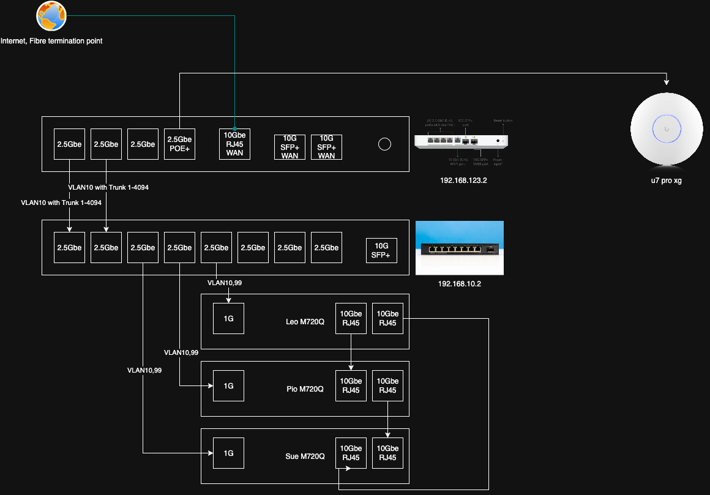    
This setup gives these benefits and satisfy my use case:   
- I can directly configure Traffic flow from Unifi Policy Engine.   
- The tagged VLANs can be used across all the nodes within Proxmox Cluster. This is the main and biggest benefit!   
- I can create more VLANs as needed very easily.   
   
## Hardware used   
If you're familiar with Singapore's Public Housing flats, the space we get is rather small to have a full blown rack like what most of the r/homelab users have in their homes. The public houses in Singapore comes with a dedicated cabinet for Electrical Distribution board boxes, which is ideal to have all the electronic stuffs in there. So this is my take of homelab in Singapore to have a minimalist, space efficient and somewhat future proofed network. The hardware I used include   
- Unifi Cloud Gateway Fiber (UCG)   
- 2.5G Horaco Managed Switch for networking the lenovo m720q mini PCs   
- u7 pro xg for home wifi.   
   
## Configuration on Unifi Cloud Gateway Fiber   
We'll have to create VLANs on the UCG first. The 2 VLANs created are VLAN10 for HomeLab/persistent services and VLAN99 for reversing labs. Creation of VLANs are straightforward on UCG fibre. I keep a lot of default settings for homelab VLAN. For the reversing lab vlan, I unchecked the Auto-Scale Network feature and isolated the network to prevent any traffic flow to other networks. Below is a screenshot of the configuration on ReversingLab VLAN   
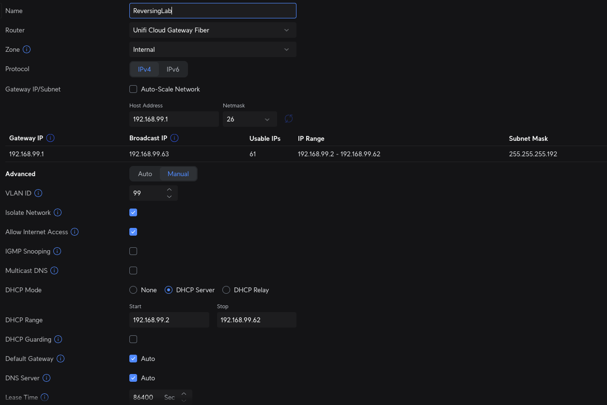    
## VLAN configuration   
### For UCG Fiber   
If you looked at the earlier network diagram, You can see that the 1st port on UCG fiber is physically connected to the Horaco switch on port 1 with Trunked VLAN. Trunked VLAN configuration UCG fiber could get a little confusing hence this part is the most important part to configure. The way I achieved this is by doing the following:   
- HomeLab VLAN10 is configured as Native VLAN on the port   
- No VLAN tagging and allow all VLANs to pass through, hence trunking all the VLANs on the port   
    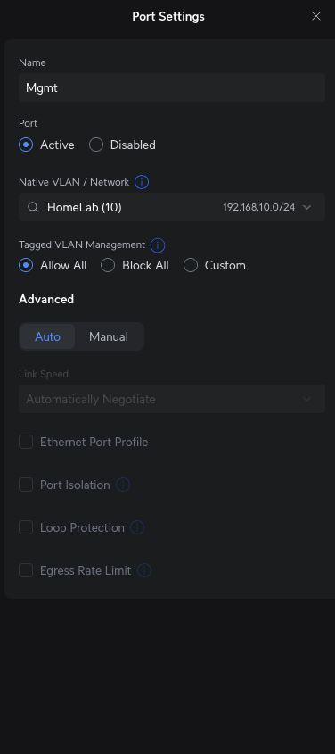    
   
### For Horaco Switch   
You will first need to setup the switch by assigning a static IP that falls within the VLAN10 192.168.10.0/24 in my case. I assigned it 192.168.10.2. This will allow you to reach the switch's Web UI for administration. The most important thing in the 1st setup is to ensure you changed your default admin password.    
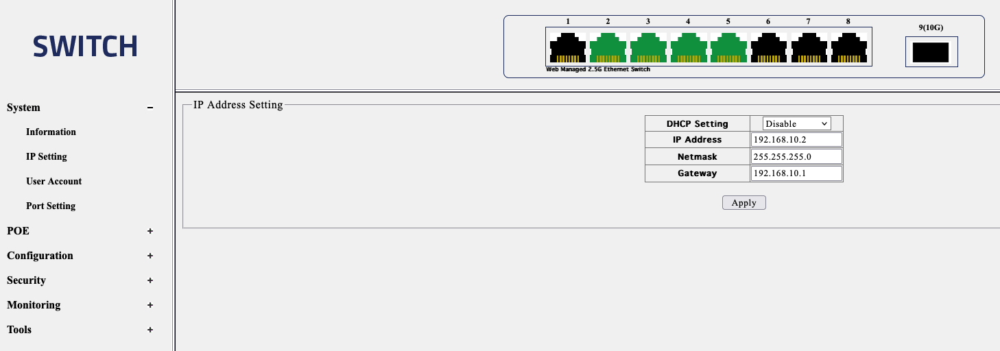    
On the switch configuration side, You first need to untag the ports that the Router/Firewall (In my case UCG Fiber and the Horaco Switch) are physically connected to from native VLAN (VLAN1) and tag them as VLAN 10. In my case I have untagged Ports 1 and 2 from VLAN1 and tagged them as VLAN10. Afterwards, you will have to tag VLAN10 and 99 on all the ports you will be physically connecting the Proxmox Nodes to. Here's the screenshot of it.    
For VLAN10 Mgmt   
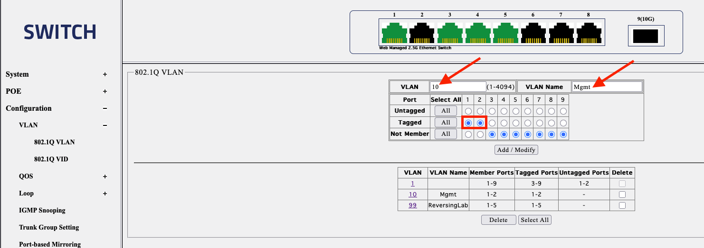    
For VLAN99 ReversingLab   
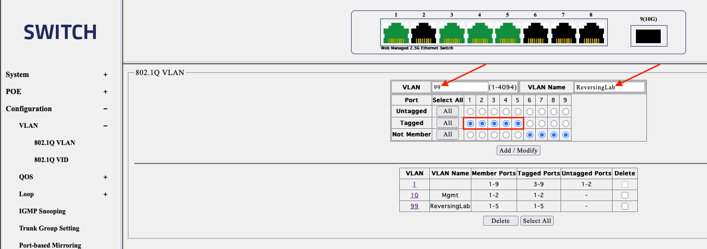    
Be sure to save the configuration once done via Tools ⟶ Save ⟶ Save Configuration   
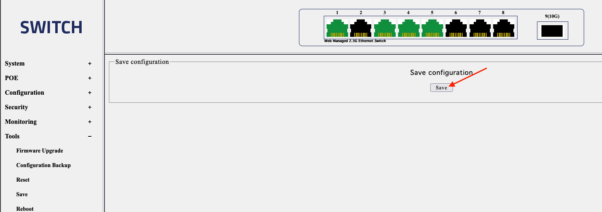    
## Proxmox VLAN Tagging on the machines   
The very fist step you need to do is to turn on the VLAN aware feature on the physical node itself. This will allow virtual machines to be vlan tagged and traffic flow between the machines across the physical nodes.   
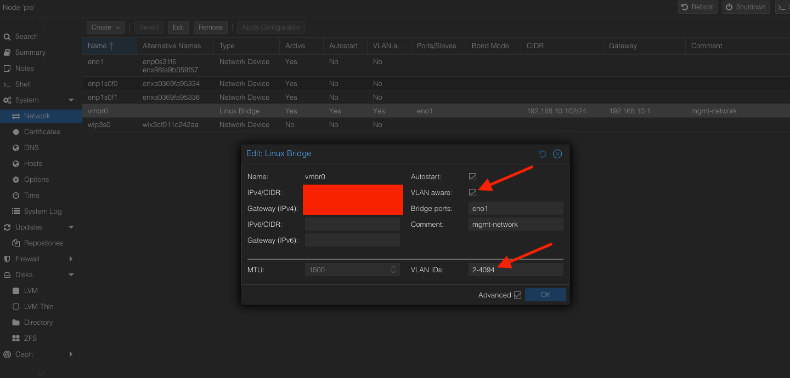    
If all the above steps are done correctly, You will be able to tag VLANs when you are deploying virtual machines within Proxmox.   
    
With that VLAN tag, your VM should get dynamically assigned an IP address and have access to the internet BUT can't reach the internal networks. A sample of it below:   
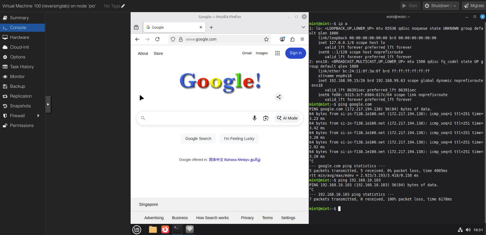    
Once you're all done setting up the VMs by downloading necessary stuffs, you can simply create a policy on Unifi to block all traffic on the network. Keeping it very very secure.   
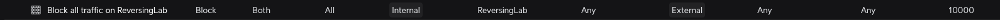    
A screenshot of blocked internet traffic on the tagged VM.   
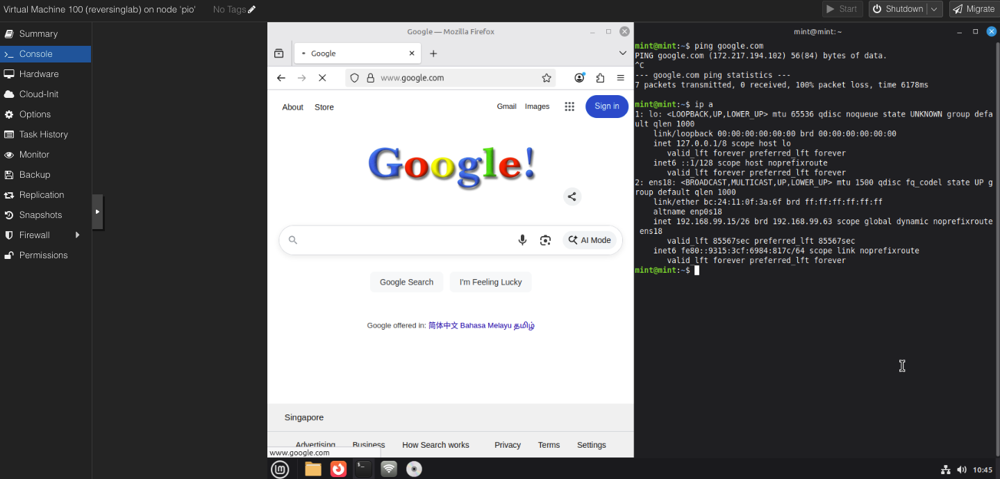    
A screenshot of the traffic flow on 2 virtual machines across 2 physical nodes   
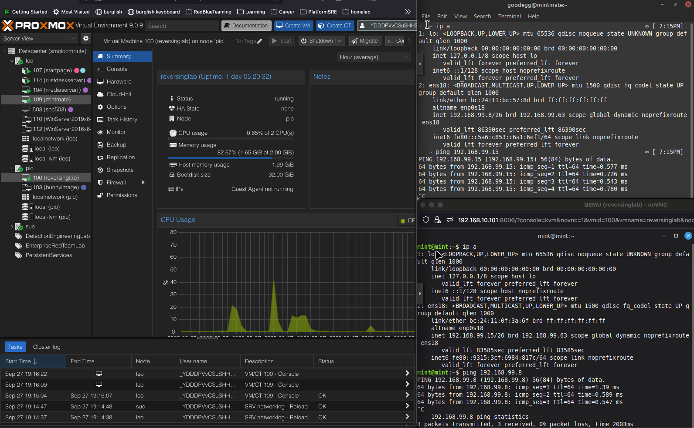    
Hopefully this helped someone out there looking for how this is being done!   
