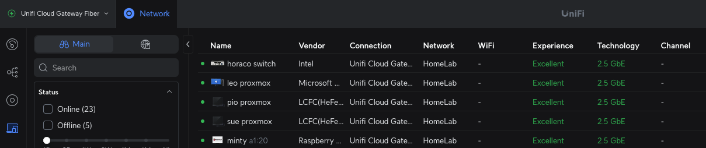

## Introduction

Here in Singapore, we often take our home Wi-Fi network for granted. Typically, we just have a technician from our Internet Service Providers (ISPs) set up the router, the Optical Network Terminal (ONT), and related equipment in the DB box, and that's the end of it. This usually leaves all our devices—Laptops, PCs, Tablets, and Internet of Things (IoT) devices—on a single, flat network (or perhaps some basic VLANs) without proper segmentation. This setup is perfectly adequate if your only goal is connect to the internet.

However, for power users and anyone running a homelab, this lack of segmentation is a major security concern. I've already walked you through my own home network setup and segmentation strategy in [this article and video](https://greatsghomelab.github.io/posts/setting-up-secure-home-network-in-singapore/). Today, I want to dive deeper into the observability of that network. Specifically, we'll explore:

- The overall internal home network activity.
- Which devices are connected to which network segment.
- How to detect suspicious devices and use their MAC addresses for quick identification.

## First look at the client devices that are connected in your network

The screenshot above shows the Unifi Cloud Gateway Fiber (UCG)'s web dashboard that shows all the connected devices connected to the different networks that I have created previously. The UCG does a good job of identifying devices by their hardware vendor, which makes initial identification easier, but this information isn't always complete.

## Identifying the connected devices

While the information provided by the UCG is a great starting point, we can dig deeper to hunt for suspicious devices on our network.

To get started, let's have a quick refresher.

Since we're dealing with physical devices, we need to understand that each one is assigned a unique MAC address (Media Access Control) right when it's manufactured. Think of the MAC address as the device's permanent, physical street address.

The network uses this MAC address (Layer 2) to assign an IP address, which allows the device to communicate on Layer 3, the Network Layer. This is where routing across the internet or between different subnets happens. Essentially, the MAC address gets the device in the door, and the IP address tells the router where to send its data.

To find a device's MAC address in the UniFi dashboard, simply click on it, and the details will be displayed as shown below.

This panel has three tabs: Overview, Insights, and Settings. In the Insights tab, you can see the device's IP address, the network it's connected to, and its traffic activity, such as which sites it has visited. In the Settings tab, once you have identified the device, you can assign it a helpful alias.

Okay, so you have the MAC address from the Overview tab and some basic device information from the UCG. What's next?

This is where online MAC address lookup tools like <https://dnschecker.org/mac-lookup.php> become useful for further investigation. You can simply paste the MAC address into the tool to find more details about the hardware manufacturer.

In this example, the lookup tool identified the vendor as "LCFC (Hefei) Electronics Technology Co., Ltd." I had no idea what this was, but a quick Google search revealed that it's "Lenovo's largest global R&D and manufacturing base for personal computers." This simple step gave me much more confidence in identifying the device.

## Conclusion

And that's a quick look at how you can use MAC addresses to identify and investigate devices on your home network. I hope you found this guide useful.

Please share your own experiences or tips in the comments section below. If you learned something today, give this video a "Like," and don't forget to subscribe for more content in the future.
